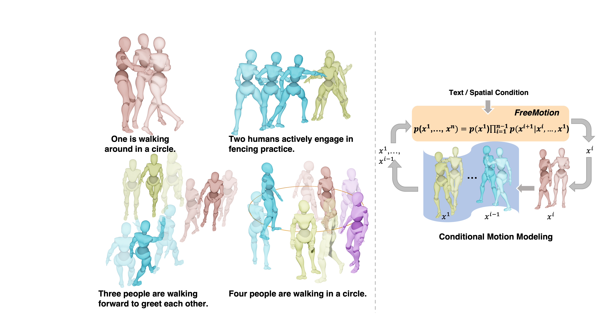
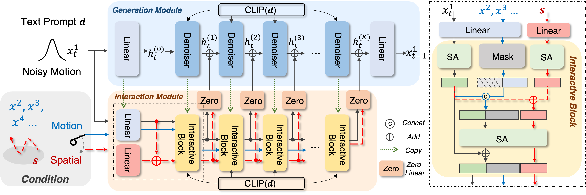

<div align= "center">
    <h1> Official repo for FreeMotion </h1>

</div>

<div align="center">
    <h2>FreeMotion: A Unified Framework for Number-free Text-to-Motion Synthesis</h2>

<p align="center">
  <a href="https://vankouf.github.io/FreeMotion/">Project Page</a> •
  <a href="https://arxiv.org/abs/2405.15763">Arxiv Paper</a> •
  <a href="">Dataset Link</a> •
  <a href="#-citation">Citation
</p>

</div>

<div align="center">
</img>
</div>

<div align="center">
<video src="./assets/demo_teaser.mp4" width="80%" autoplay controls muted loop playsinline></video>
</div>


## Intro FreeMotion

Text-to-motion synthesis is a crucial task in computer vision. Existing methods are limited in their universality, as they are tailored for single-person or two-person scenarios and can not be applied to generate motions for more individuals. To achieve the number-free motion synthesis, this paper reconsiders motion generation and proposes to unify the single and multi-person motion by the conditional motion distribution. Furthermore, a generation module and an interaction module are designed for our FreeMotion framework to decouple the process of conditional motion generation and finally support the number-free motion synthesis. Besides, based on our framework, the current single-person motion spatial control method could be seamlessly integrated, achieving precise control of multi-person motion. Extensive experiments demonstrate the superior performance of our method and our capability to infer single and multi-human motions simultaneously.



## ☑️ Todo List

- [✓] Release the FreeMotion training.
- [✓] Release the FreeMotion evaluation.
- [] Release the separate_annots dataset.
- [] Release the FreeMotion checkpoints.

## Quick Start

<!-- <details>
  <summary><b>Setup and download</b></summary> -->

### 1. Conda environment

```
conda create python=3.8 --name freemotion
conda activate freemotion
```

```
pip install -r requirements.txt
```

### 2. Download Text to Motion Evaluation Model

```
bash prepare/download_evaluation_model.sh
```


## Train and Evaluation your own models

### 1. Prepare the datasets

> Download the data from [InterGen Webpage](https://tr3e.github.io/intergen-page/). And put them into ./data/.

> Download the data from [Ours Webpage](https://vankouf.github.io/FreeMotion/) And put it into ./data/.

#### Data Structure
```sh
<DATA-DIR>
./annots                //Natural language annotations where each file consisting of three sentences.
./motions               //Raw motion data standardized as SMPL which is similiar to AMASS.
./motions_processed     //Processed motion data with joint positions and rotations (6D representation) of SMPL 22 joints kinematic structure.
./split                 //Train-val-test split.
./separate_annots       //Annotations for each person's motion
```

### 2. Train

#### Stage 1: train generation module
```
sh train_single.sh
```

#### Stage 2: train interaction module
```
sh train_inter.sh
```

### 3. Evaluation

```
sh test.sh
```

## 📖 Citation

If you find our code or paper helps, please consider citing:

```bibtex
@article{fan2024freemotion,
      title={FreeMotion: A Unified Framework for Number-free Text-to-Motion Synthesis}, 
      author={Ke Fan and Junshu Tang and Weijian Cao and Ran Yi and Moran Li and Jingyu Gong and Jiangning Zhang and Yabiao Wang and Chengjie Wang and Lizhuang Ma},
      year={2024},
      eprint={2405.15763},
      archivePrefix={arXiv},
      primaryClass={cs.CV}
}

```

## Acknowledgments

Thanks to [interhuman](https://github.com/tr3e/InterGen),[MotionGPT](https://github.com/OpenMotionLab/MotionGPT), our code is partially borrowing from them.

## Licenses
<a rel="license" href="http://creativecommons.org/licenses/by-nc-sa/4.0/"></a><br />This work is licensed under a <a rel="license" href="http://creativecommons.org/licenses/by-nc-sa/4.0/">Creative Commons Attribution-NonCommercial-ShareAlike 4.0 International License</a>.